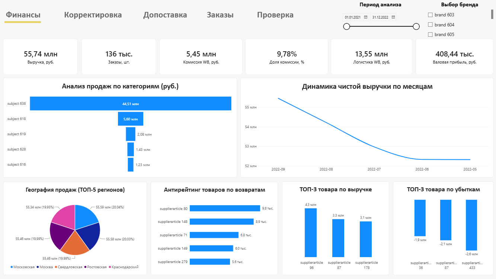

# Интерактивный финансовый дашборд для Wildberries (ИП Кулемина)

📂 **[СКАЧАТЬ ОРИГИНАЛЬНЫЙ ФАЙЛ .PBIX С ЯНДЕКС.ДИСКА](https://disk.yandex.ru/d/zLd66GLy3DYVQw)**

Профессиональный аналитический отчет в Power BI Desktop, разработанный на основе реального технического задания для e-commerce бизнеса. Дашборд консолидирует данные из нескольких источников, рассчитывает ключевые показатели юнит-экономики маркетплейса и визуализирует их строго по предоставленному бизнес-макету (Mockup).

## 📊 Скриншот дашборда

## 🎯 Бизнес-задачи проекта
* **Собрать модель данных:** Объединить разрозненные транзакционные базы маркетплейса со справочниками себестоимости и номенклатуры.
* **Рассчитать реальную прибыль:** Очистить показатели от системного мусора и отмененных заказов, корректно учесть логистику, комиссии и налоги маркетплейса.
* **Подсветить зоны роста и убытков:** Вывести для собственника географический срез продаж, антирейтинг бракованных товаров по возвратам и выявить убыточные позиции ассортимента.

## 🛠️ Архитектура и стек технологий
* **Источники данных:** Реляционная база данных PostgreSQL (API Wildberries) + внешние справочники из Google Таблиц.
* **ETL-процесс (Power Query / M):** 
  * Нормализация регистров и глубокое усечение скрытых пробелов (`Trim`/`Clean`) в текстовых ключах связей для восстановления разорванных линков.
  * Фильтрация системных `null` и битых транзакций (`Blank`), искажавших общую себестоимость.
* **Модель данных:** Архитектура **«Звезда» (Star Schema)** с жестким контролем направлений фильтрации. Настроена однонаправленная связь «Многие ко многим» для складских остатков без создания циклических зависимостей. Двунаправленные связи исключены во избежание задвоения финансовых результатов.
* **Аналитика (DAX):** Написан пакет изолированных мер с использованием безопасного деления (`DIVIDE`) и контекстных вычислений (`CALCULATE`, `SUMX`, `LOOKUPVALUE`).

## 🧮 Ключевые метрики и логика расчетов
1. **Выручка WB:** Розничный оборот (`retail_amount`) за вычетом оформленных возвратов.
2. **Себестоимость total:** Рассчитана через поштучное сопоставление продаж с ценами закупки по уникальным баркодам.
3. **Валовая прибыль:** Реализована сложная формула: `Выручка` − `Комиссия WB` − `Логистика WB` − `Себестоимость total` − `Налог 2%` от объема розничных продаж (с учетом возврата налога и себестоимости для возвращенных товаров с обратным знаком).

## 📈 Итоговые финансовые показатели модели
* **Чистая выручка WB:** 55,74 млн руб.
* **Общее количество заказов:** 136 тыс. шт. (после отсечения 6 тыс. мусорных строк без артикулов).
* **Удержанная комиссия маркетплейса:** 5,45 млн руб. (Доля комиссии: 9,78%).
* **Затраты на логистику:** 13,55 млн руб.
* **Чистая валовая прибыль:** +408,44 тыс. руб. *(Модель успешно очищена от системного мусора базы данных, что позволило вывести реальный финансовый результат компании из виртуального убытка в плюс)*.

## 🎨 Визуальные решения (UI/UX)
Интерфейс спроектирован строго по сетке Mockup-макета компании:
* **Навигация:** Имитация панели вкладок (`Финансы`, `Корректировка` и т.д.) с визуальным акцентом на активной странице.
* **Фильтры:** Симметричные срезы по периодам анализа (динамическая шкала дат) и брендам.
* **KPI-карточки:** 6 верхних индикаторов с центрированными заголовками, полностью очищенные от технического шума стандартных осей Power BI.
* **Аналитические блоки:** Линейный график тренда выручки, воронка категорий товаров, а также четыре визуальных ТОПа в нижнем ряду, ограниченных через фильтрацию `Top N` для максимальной читаемости.
